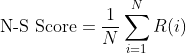

# Dataset
## INRIA Holidays Dataset
The INRIA Holidays dataset is a widely used benchmark for image and video retrieval tasks. It contains 1491 images, 500 images for query.
### Download and Extract
1. Download the dataset from [Kaggle](https://www.kaggle.com/datasets/vadimshabashov/inria-holidays).
2. Extract the contents to the `datasets/INRIA/` directory.
### Directory Structure
After extracting, the directory structure should look like this:
```plaintext
datasets/
└── INRIA/
    ├── images/
    │   ├── 100000.jpg
    │   ├── 100001.jpg
    │   ├── ...
    └── groundtruth.json
```
## UKB Dataset
The UKBench Dataset is a widely used benchmark dataset for evaluating image retrieval and object recognition systems. It contains a collection of high-quality images designed to test the accuracy and efficiency of retrieval algorithms. It há 2,550 unique objects. Each object is represented by 4 images about front view, 2 side views and top or bottom view, making a total of 10,200 images.
### Download and Extract
1. Download from (https://archive.org/download/ukbench/ukbench.zip).
2. Extract the contents to the `datasets/UKB/` directory.
### Directory Structure
After extracting, the directory structure should look like this:
```plaintext
datasets/
└── UKB/
    ├── full/
    │   ├── ukbench00000.jpg
    │   ├── ukbench00001.jpg
    │   ├── ...
    ├── thumbnails/
    │   ├── ukbench00000.th.jpg
    │   ├── ukbench00000.th.jpg
    │   ├── ...
    └── overview.html

```
# Evaluation Matrix
## Overview

The evaluation matrix is used to assess the performance of image retrieval algorithms. It provides various metrics to evaluate the accuracy and efficiency of the retrieval process.
## Metrics

The evaluation matrix includes the following metrics:
- **Mean Average Precision (mAP)**: The mean of the average precision scores for each query, providing a comprehensive measure of retrieval performance. This metric is used to measure the performance of the INRIA dataset.

- **N-S Score**: 
<div style="text-align: center;">
  
</div>


  Where:
  - N is the total number of items.
  - R(i) is the relevance score of query i th.